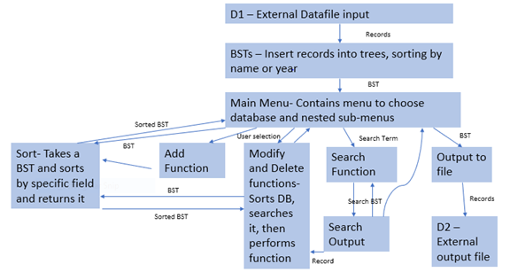

Title: Oscar Database

Name: Daniel Schlatter

Date: 12/6/18

# Program Report

## Problem Description

Generally, this program creates databases in the form of binary search trees with input from csv files. The program has functionality to allow a user to either add, delete or modify records in the databases, as well as search for records, with both exact matches and partial matches depending on the users choice, and sort records by particular fields. It can also print out the modified databases, to both the console and a file. In this particular implementation, the databases are composed of information from the Academy Awards, with input files for actor/actress data and data from individual movies.

## Overall Software Architecture/Summary of provided functions

* xSort: these two functions simply sort the binary search tree passed to them as a parameter and return the sorted tree.

* xSearchForNode: These functions find specific nodes and return them

* xSearch: These functions return a BST of the search results

* searchKey: recursively searches a BST and adds positive results to another BST, for use by the xSearch functions

* searchKeyVect: similar to search key except adds positive results to a vector

* addNode, deleteNode, PrintInOrder, PrintInOrderToFile: these are BSTree member functions that do what their name implies.

## Input Requirements
The non-keyboard external input will consist of two files: actor-actress.csv and pictures.csv.

actor-actress.csv will have 5 fields in each line:

1. Year – String
2. Award – String
3. Winner – String
4. Name – String
5. Film – String

Pictures.csv will have 10 fields in each line:

1. Name – String
2. Year - String
3. Nominations – String
4. Rating – String
5. Duration – String
6. Genre1 – String
7. Genre2 - String
8. Release – String
9. Metacritic – String
10. Synopsis – String

External Keyboard Input:

Keyboard input will be either an int to select a menu option, or a string representing a search term.

## Output Requirements

Outputs to Files:

The outputs variables are the same as the file input variables. All are strings. The whole database can be printed to a file or a console, depending on user input, or parts of the database, whether it is a single record or several, can be outputted to the console as well.

Actor Database will have 5 fields in each line:

1. Year – String
2. Award – String
3. Winner – String
4. Name – String
5. Film – String

Movie Database will have 10 fields in each line:

1. Name – String
2. Year - String
3. Nominations – String
4. Rating – String
5. Duration – String
6. Genre1 – String
7. Genre2 - String
8. Release – String
9. Metacritic – String
10. Synopsis – String

## Problem Solution Discussion

I used a recursive algorithm to search the binary search tree by its key. Positive results are added to another search tree, which is then repeated until the user quits out of the search. To sort, I simply created a new tree, added the old trees root to it, then deleted the old trees root until the old tree was emptied. When I needed to search for a particular record in the modify and delete functions, I searched the tree recursively again, but added all the results to a vector, which I then iterated through with a for loop to find the match of the other search term the user inputted.

## Data Structures

I use only 2 sub-containers, a vector and another binary search tree. I use the vector for the function that finds a specific record. This could have been a stack, linked list, queue, etc., all I am doing with this sub container is adding search results that have the same name as the name the user searched for, and then I am iterating through it with a for loop to find a record that matches the year that the user searched for. I chose vector because they are what I am most familiar with and are simple to use as well. The second container, the other binary search tree, is used to add all search results from the function that returns several results. I used a BST because this would allow me to use the sorting functions I already had for the main tree, and the printing function I had for the main tree. The tree also needed to be searched again, so it made sense to have another tree since initially the first tree was the one being searched, so I could just use the same search method.

## User Interface Scheme

Choose the Database you wish to access: (both options will display the same menu options after one is chosen so I will only list them once)

All numbered menu options will be navigated by the user entering an integer corresponding to the options.

1. Actress-Actor Database
2. Picture Database
	1. Display Database: No further input required.
	2. Add a record: Input will be taken for each field that a record in the database has.
	3. Search for a record and modify the fields: Input will be taken for the name and year of the record. Then, a further menu will be produced for the user to choose which field they want to modify or if they are done. It will re iterate until the user indicates they are done. It will then allow the user to choose to search for another record to modify or quit out of the function
	4. Search for a record and delete the fields: Input will be taken for the name and year of the record. It will then display the record and ask the user to confirm deleting it. A 1 indicates a confirmation, and anything else will cancel the deletion. Then it allows the user to choose to either search for another record to delete or quit out of the function.
	5. Sort by any single (sortable) field: A menu of the sortable fields in this database will be produced and the user will be asked to choose the option they want to sort by.
	6. Complete or Partial search on any field: The user will first be asked whether they wish to perform a complete or a partial searched, then a menu of fields will be produced and the user will choose which field they wish to search, and then the user will be asked to input their search term. If any search results are found, the user will be asked if they would like to search within the search results, and if they choose yes, the previous options will be presented again on the search tree, and this continues until the user decides to quit.
	7. Output to a file: The user will be asked to input the name of the file they wish for the database to be outputted to.
  	8. Exit this database: Exits database and returns user back to the database choosing menu.  
3. Exit Application

## Status of Application

I developed the Final Project in CLion, and it compiles and operates properly on CSEgrid. All requirements were met. As of now I am unaware of any bugs or issues.
